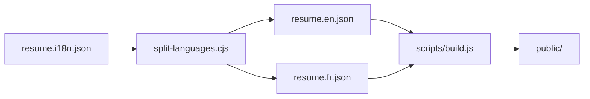

# AGENTS.md

Instructions for AI coding agents working on this repository.

## Project overview

Single-source resume for **Ludovic Valente**, published in multiple **languages** (EN, FR) and **formats** (HTML, PDF, Europass XML/HTML/PDF). Data follows the [JSON Resume](https://jsonresume.org/) schema with a custom i18n convention.



**Human-facing docs:** [README.md](README.md). **GitHub Pages** publishes the `public/` directory only.

## Source of truth

| File | Role |
|------|------|
| `resume.i18n.json` | **Edit this** for content and translations |
| `resume.en.json`, `resume.fr.json` | Generated per-language JSON Resume files (repo root; committed) |
| `archive/resume-v1.json` | Historical snapshot; do not use for builds |

### i18n field convention

Translatable strings use `{lang}_{field}` on the same object (e.g. `en_summary`, `fr_summary`). After split, the active language prefix is stripped and copied to the base key (`summary`).

Languages come from `meta.languages` in `resume.i18n.json` (currently `en,fr`). Split sets `meta.locale` per language.

## Supported languages

Defined in `scripts/lib/lang-paths.js`: `en`, `fr` only. Locale mapping: `en` → `en-US`, `fr` → `fr-FR`.

## Build

All **published** outputs live under `public/` (see `pathsForLang` in `scripts/lib/lang-paths.js`).

```bash
npm ci
sh scripts/split.sh
npm run build:site       # public/index-*.html, pdf/resume-*.pdf, public/index.html
npm run build:europass   # public/resume.*.europass.*
npm run validate
```

`sh scripts/generate.sh` runs `build:site` after split.

CI: [.github/workflows/split-i18n.yml](.github/workflows/split-i18n.yml) → `npm run build:site` + `build:europass` → commit `public/` → deploy `publish_dir: public`.

### Output paths (`public/`)

| Artifact | Path |
|----------|------|
| Homepage | `public/index.html` (copy of `index-en.html`) |
| HTML per lang | `public/index-en.html`, `public/index-fr.html` |
| PDF per lang | `pdf/resume-en.pdf`, `pdf/resume-fr.pdf` (+ copy in `public/pdf/` for Pages) |
| Europass | `public/resume.{lang}.europass.xml`, `.html`, `.pdf` |

Profile links use paths **relative to the site root** (e.g. `index-fr.html`, `pdf/resume-en.pdf`).

## Code layout

| Path | Purpose |
|------|---------|
| `index.js` | Re-exports `render` from `jsonresume-theme-ludoo` |
| `europass/` | Europass Handlebars theme for `resume-cli --theme ./europass` |
| `scripts/build.js` | CLI entry for all build targets |
| `scripts/lib/build-resume.js` | Orchestrates renders and exports |
| `scripts/lib/europass-xml.js` | JSON Resume → Europass SkillsPassport XML v3.4 |
| `.github/scripts/split-languages.cjs` | i18n split (and optional legacy `resume export` to `public/`) |

## Conventions

- **Module system:** `"type": "module"` in `package.json`.
- **Do not** hand-edit `en_*` / `fr_*` in `resume.en.json` / `resume.fr.json`; edit `resume.i18n.json` and re-run split.
- **Europass XML:** validate after changes (`npm run validate`). Requires `xmllint`.
- **Commits:** CI commits `public/` and per-lang JSON; avoid conflicting manual edits.

## Boundaries

- **Secrets:** `GIST_ID`, `GIST_TOKEN` in GitHub Actions only.
- **XSD vendor tree:** refresh with `npm run xsd` only.
- **HTML** → `public/` only. **JSON Resume PDF** → `pdf/` (mirrored to `public/pdf/` when built).

## Prerequisites

- Node.js 20+
- `resume-cli` (global or via `RESUME_CLI`)
- `xmllint` for Europass validation
- `RESUME_PUPPETEER_NO_SANDBOX=1` in CI for PDF export

## CI (GitHub Pages)

Workflow deploys **`public/`** to `gh-pages`. Live URLs omit the `public/` prefix, e.g. `…/resume/index-fr.html`, `…/resume/resume.en.europass.html`.
